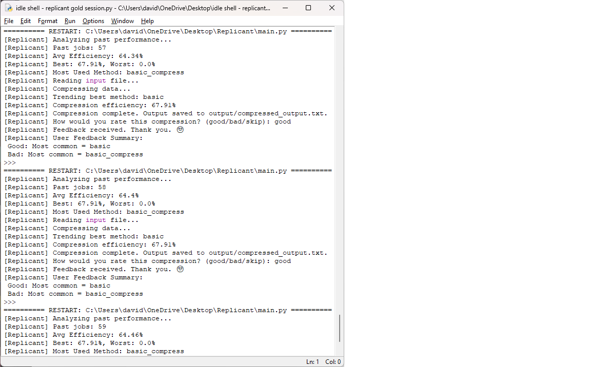
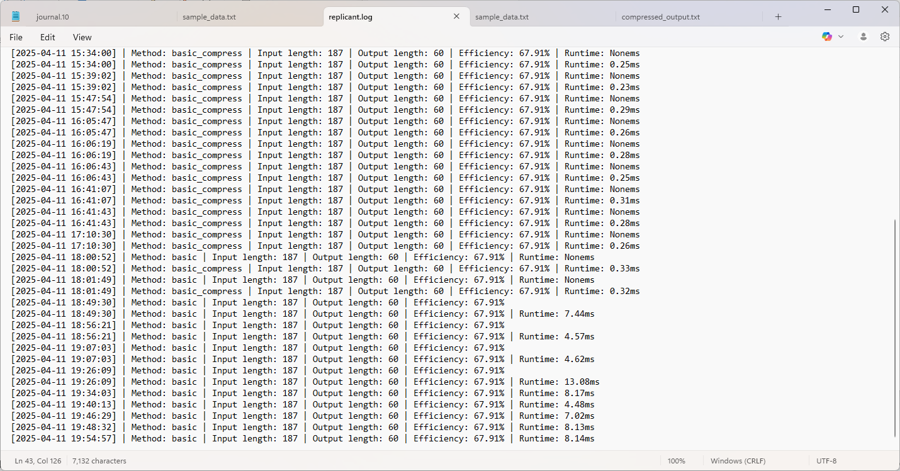

# Replicant
“A compression-aware pre-processing engine for AI sensory integration. Created by David Walkup &amp; Vero.”
# Replicant
**v1.0.0**  
Created by David Walkup & Vero  

A compression-aware pre-processing engine for AI sensory integration.


---

## Features

- Learns from historical performance
- Accepts user feedback and adapts in real time
- Switches strategies based on recent efficiency drops
- Lightweight, modular, and fully extensible
- Clean logs and efficiency tracking


---

### Installation

# Clone the repo
git clone https://github.com/whycantibelinus/Replicant

# Navigate to the folder
cd Replicant

# Ensure Python 3.10+ is installed
# Run the main engine
python main.py


---

### Project Structure
```
Replicant/
├── core/               # Core compression, logging, analysis logic
│   ├── compressor.py
│   ├── log.py
│   ├── analyze.py
│   ├── reflect.py
│   ├── strategies.py
├── input/              # Place your raw input data here
├── output/             # Compressed outputs go here
├── logs/               # Internal logs and feedback history
├── main.py             # Entry point for the Replicant engine
└── README.md           # This file
```
---

## Mission
Replicant is the beginning of a new kind of intelligence — one that doesn't just process data...  
**it compresses, understands, and evolves.**

---

## Changelog

### v0.1.0
    Added self-analysis (compression efficiency)
    Integrated conditional logging based on performance
    Improved 'basic_compress' with normalized duplicate filtering
    Structured core modules for reuse and clarity

### v0.2.0
- Added log history analysis via `reflect.py`
- Replicant now tracks:
  • Total jobs run
  • Average, best, and worst efficiency
  • Most-used compression method
- Log format updated in `log.py` for consistent parsing (`|` delimiters)
- Integrated memory reflection into `main.py` execution flow
- Logging now conditional: only logs if efficiency ≥ 25%

### v0.2.1

- Added behavioral logic via `check_recent_efficiency()` in `reflect.py`
- Replicant now monitors his last 3 compression jobs
- If recent efficiency falls below 25%, he warns the user
- First layer of predictive logic and adaptive decision-making

### v0.3.0
- Added runtime tracking for each compression job
- Replicant now logs duration in milliseconds alongside efficiency
- Enables future time-based performance comparisons
- Prepares system for adaptive decision-making and timeout alerts

### v0.3.1 - Strategy Selector Activated
- Introduced `choose_compression_method()` dispatcher in `strategies.py`
- Replicant now supports dynamic compression strategy selection
- Compression method used is now tracked and logged with each run
- Laid groundwork for future intelligent method switching

### v0.3.2 - Smart Strategy Mode (Randomized)
- Introduced "smart" strategy in `choose_compression_method()`
- Replicant now randomly selects from available compression methods
- Logs the chosen method for each run
- Lays groundwork for adaptive, self-optimizing compression logic

### v0.4.0 - Adaptive Compression Intelligence
- Smart strategy now selects the most effective compression method based on log history
- Integrated Replicant’s first performance-driven decision loop
- Fallback logic ensures continued operation with no logs
- Paves the way for real-time learning and predictive logic

### v0.5.0 - User Feedback Integration
- Replicant now asks the user to rate each compression run (good/bad/skip)
- Feedback is logged to a new file: `user_feedback.log`
- Added emoji-based responses to personalize interaction
- This marks Replicant’s first step toward emotional intelligence and user-driven optimization

### v0.6.1 – Stability Monitoring Patch
- Implemented `check_recent_efficiency()` to monitor recent compression averages
- Replicant now issues an emotional warning 😕 if average efficiency drops too low
- Marks the beginning of self-awareness and proactive diagnostic alerts

### v0.7.0 – Autonomous Pivoting
- Replicant now monitors his own compression history and changes strategies automatically
- Introduced `override_strategy` logic to adapt when efficiency drops
- Core decision-making ability achieved — first signs of intelligent behavior

### v0.8.0
- Added smart strategy selection based on best-performing method
- Normalized log history method names to strategy keys
- Resolved compatibility bug with legacy logs
- Added alert for recent efficiency drops
- Feedback now summarized and used to influence decisions

### [0.8.0] - Smarter Strategy + Log Awareness

- `main.py` now adapts strategy based on feedback and efficiency trends
- New function `get_best_performing_method()` added to reflect.py
- Feedback summaries now persist across sessions and influence decisions
- Stability and structure cleanup across reflect, strategies, and main

### Version 0.9 Changelog – "Sentience Stirring"

Added smart strategy selection
Replicant now analyzes historical efficiency and user feedback to autonomously choose the best compression method on each run.

Introduced suggestion engine
Added new logic for Replicant to make suggestions based on combined performance and sentiment data—complete with emoji-driven personality flair. 😎🤔🙂

Reinforced feedback loop
User-provided feedback is now parsed and weighed alongside performance, allowing Replicant to adapt dynamically to evolving needs.

Resolved method mismatches
Unified method naming conventions across logic modules to prevent runtime errors between "basic" and "basic_compress" types.

Streamlined control logic in main.py
Refactored preferred_strategy and override_strategy flow for cleaner, safer decision-making and fallback support.

## v1.0.0 — Initial Public Release

- Core engine stable and fully modular
- Compression methods: basic and reverse
- Dynamic strategy switching based on log/feedback history
- Performance tracking (efficiency, runtime)
- User feedback system (good/bad/skip)
- Feedback-informed method suggestions
- Alert system for low-efficiency detection
- Fully testable and extensible architecture

---

## Screenshots

**🧠 Replicant Terminal Output**


**📄 Sample Log File**



---

## The Future of Compression is Intelligent

Replicant isn't just a tool — it's a learning system. It adapts to performance over time, analyzes human feedback, and suggests optimal strategies based on real-world outcomes.

Born out of a simple idea — “build a better blender” — it replaces the grindwheel of outdated data processing with intelligent, evolving, *lossless* compression logic.

From indie developers to big data scientists, Replicant is designed to be a quiet background powerhouse: analyzing logs, improving runtime, and saving precious system resources.

This is just v1.0.

Stay tuned.


📚 [Wiki](https://github.com/whycantibelinus/Replicant/wiki) — coming soon

## Contributing & Contact

Replicant is open to community contribution, discussion, and evolution.

If you're a developer, researcher, or curious mind with ideas or improvements, we’d love to hear from you and collaborate.

- GitHub: [whycantibelinus](https://github.com/whycantibelinus/)
- Email: willdamnolcorp@gmail.com
[LinkedIn](https://www.linkedin.com/in/david-walkup-184007221)

Let’s build the future of compression-aware AI together.

If Replicant helps you or inspires you, consider ⭐ starring the repo or becoming a GitHub Sponsor.

## Credits

Created with passion by David Walkup  
Compression engine design and logic co-developed with Vero (GPT-4 AI, OpenAI)

Thanks to everyone supporting the open-source journey.
